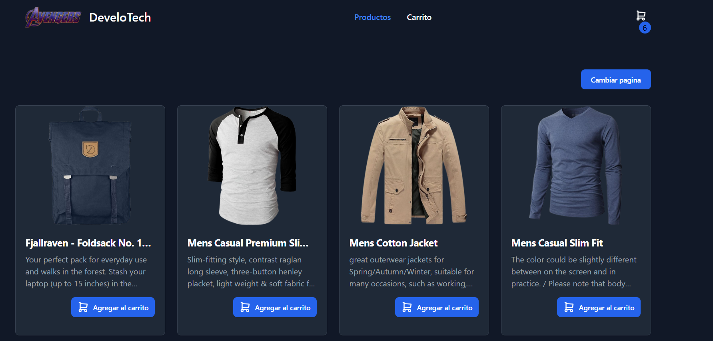

`Url:` https://jose-daniel-g.github.io/frontend-store/inicio
#### Angular-Store
#### Product Catalog and Cart Application

Este es un proyecto de **Angular** que permite gestionar un catálogo de productos, ver los detalles de cada producto, agregar productos al carrito de compras y navegar por las distintas secciones de la aplicación.

### Funcionalidades

1. **Iniciar sesión**: Los usuarios pueden iniciar sesión en la aplicación mediante una interfaz de inicio de sesión.
2. **Catálogo de productos**: Se muestra una lista de productos con la posibilidad de ver más detalles de cada uno.
3. **Detalle de producto**: Cada producto tiene una página de detalles donde se muestra información más detallada, como su imagen, precio y descripción.
4. **Carrito de compras**: Los usuarios pueden agregar productos al carrito y ver su lista de productos agregados.

### Tecnologías utilizadas

- **Angular**: Framework principal para el desarrollo de la aplicación.
- **Tailwind CSS**: Framework de diseño para el estilo de la interfaz de usuario.
- **Router de Angular**: Para la navegación entre las distintas páginas de la aplicación.
- **API de productos**: Para obtener la información de los productos y cargarlos dinámicamente.

### Instalación

#### Requisitos previos

Asegúrate de tener **Node.js** y **npm** instalados en tu máquina. Si no los tienes, puedes descargarlos desde [Node.js](https://nodejs.org/).

###### Pasos para la instalación

1. **Clona este repositorio**:

   ```bash
   git clone https://github.com/Jose-Daniel-G/frontend-store.git
   ```
#### Frontend-Store  
###### Deploy Angular en GitHub Pages

1. **Revisar el `angular.json`**  
   - Ir a:  
     ```json
     "projects": { "frontend-store": {
     ```
   - Ese es el **nombre de tu proyecto**.  
   - En la sección `build > options`, agrega (debajo de `outputPath`):  
     ```json
     "baseHref": "/frontend-store/"
     ```
---

2. **Instalar la herramienta de despliegue (si no está instalada)**  
   ```bash
   npm install -g @angular/cli
   ng add angular-cli-ghpages
   ng build --configuration production --base-href "/frontend-store/"
   ng deploy --base-href=https://jose-daniel-g.github.io/Angular_adminlte/
   ```
   - De lo contrario si ya esta en angular.json configurado
   ```bash
   ng build --configuration production 
   ng deploy

   ```
   *Configurar GitHub Pages en GitHub*

   **Ir a tu repo en GitHub → Settings > Pages.**

   - Seleccionar:

   - Branch: gh-pages

   - Folder: / (root)

   - Guardar.
  

  